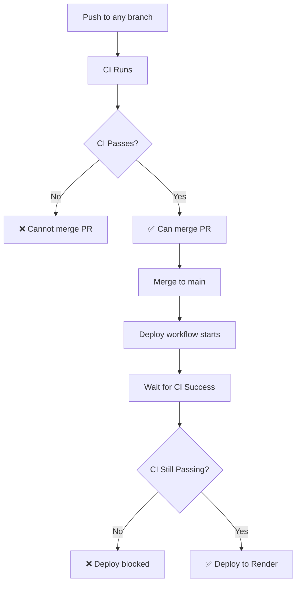

# Branch Protection Setup Guide

## Overview
This guide shows how to configure GitHub branch protection rules to ensure **NO CODE** reaches production without passing CI/CD checks.

## What We Fixed

### 1. CI Pipeline (`ci.yml`)
✅ **Runs on ALL branches** (not just specific ones)
✅ **Removed `continue-on-error: true`** from critical checks
✅ **Enforces**: Lint, Type Check, Build must pass
✅ **Added `ci-success` job** for branch protection

### 2. Deployment Pipeline (`deploy-production.yml`)
✅ **Waits for CI to pass** before deploying
✅ **Uses `needs: wait-for-ci`** to enforce dependency
✅ **Can't deploy broken code** to Render

### 3. Branch Protection Rules (Manual Setup Required)
⚠️ **YOU MUST CONFIGURE THIS IN GITHUB UI**

## How to Set Up Branch Protection

### Step 1: Go to Repository Settings
1. Navigate to: https://github.com/canfieldjuan/finetunelab.ai/settings/branches
2. Click **"Add branch protection rule"**

### Step 2: Configure Main Branch Protection

**Branch name pattern:** `main`

#### Required Settings:

✅ **Require a pull request before merging**
- Enable this checkbox
- Set **"Require approvals"** to: `1` (or `0` if you're solo)
- ✅ Check **"Dismiss stale pull request approvals when new commits are pushed"**

✅ **Require status checks to pass before merging**
- Enable this checkbox
- ✅ Check **"Require branches to be up to date before merging"**
- **Add required status checks:**
  - Search for and add: `CI Success`
  - Search for and add: `Lint Code`
  - Search for and add: `TypeScript Type Check`
  - Search for and add: `Build Application`

✅ **Require conversation resolution before merging**
- Enable this checkbox (good practice)

✅ **Do not allow bypassing the above settings**
- Enable this checkbox (enforces rules even for admins)

❌ **Allow force pushes**
- Keep DISABLED

❌ **Allow deletions**
- Keep DISABLED

### Step 3: Save Changes
Click **"Create"** or **"Save changes"**

---

## What This Achieves

### Before (Current State - Broken)
```
Developer commits to main
   ↓
CI runs but ALL checks have continue-on-error: true
   ↓
Deploy runs immediately (doesn't wait for CI)
   ↓
Broken code deployed to Render ❌
```

### After (Fixed - Protected)
```
Developer creates feature branch
   ↓
CI runs on ALL branches (lint, type-check, build)
   ↓
Developer creates PR to main
   ↓
GitHub blocks merge if CI fails ⛔
   ↓
Developer fixes issues until CI passes ✅
   ↓
PR merged to main (only if CI green)
   ↓
Deploy workflow waits for CI to pass
   ↓
Deploy to Render only if everything passes ✅
```

## Flow Diagram



## Testing the Setup

### Test 1: Break the Build
1. Create a branch: `git checkout -b test/break-build`
2. Add a TypeScript error:
   ```typescript
   const x: string = 123; // Type error
   ```
3. Commit and push
4. Check GitHub Actions - CI should **FAIL** ❌
5. Try to merge PR - should be **BLOCKED** ⛔

### Test 2: Fix and Merge
1. Fix the error
2. Push again
3. CI should **PASS** ✅
4. PR can now be merged ✅
5. Deploy waits for CI, then deploys ✅

## Verification Checklist

After setting up branch protection, verify:

- [ ] CI runs on new feature branches
- [ ] CI status appears on PRs
- [ ] Cannot merge PR if CI fails
- [ ] Can merge PR if CI passes
- [ ] Deploy waits for CI on main branch
- [ ] Deploy only proceeds if CI passes

## Common Issues

### Issue: "CI Success" check not found
**Solution:** Push a commit to trigger CI first, then add the check

### Issue: Can't find status checks in dropdown
**Solution:** Status checks only appear after they've run at least once. Push to a branch to trigger CI.

### Issue: Admin can still bypass
**Solution:** Enable "Do not allow bypassing the above settings"

### Issue: CI takes too long
**Solution:** Optimize CI by caching npm dependencies (already configured)

## Additional Best Practices

### For Teams
- Require at least 1 approval for PRs
- Enable "Require conversation resolution"
- Use CODEOWNERS file for critical paths

### For Solo Developers
- Can set approvals to 0
- Still get CI protection
- Can't accidentally merge broken code

## Render Auto-Deploy Configuration

If you have Render auto-deploy enabled, **disable it** and use GitHub Actions instead:

1. Go to Render dashboard → Your service
2. Settings → Build & Deploy
3. **Disable** "Auto-Deploy"
4. Let GitHub Actions control deployments

This ensures deploys only happen through CI/CD pipeline.

---

## Summary

✅ CI runs on **ALL branches**
✅ Critical checks **MUST pass** (no continue-on-error)
✅ Branch protection **blocks merges** if CI fails
✅ Deployment **waits for CI** before deploying
✅ **Zero chance** of broken code reaching Render

**Next Step:** Go to GitHub and set up branch protection now!
https://github.com/canfieldjuan/finetunelab.ai/settings/branches
