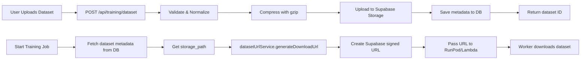

# S3 as Primary Storage - Phased Implementation Plan
**Date:** 2025-12-18
**Status:** PLANNING - AWAITING APPROVAL
**Goal:** Migrate from Supabase Storage to AWS S3 as primary dataset storage

---

## Executive Summary

### Current Architecture
```
Dataset Upload → Supabase Storage ('training-datasets' bucket) → Database metadata
Training Job → Fetch Supabase signed URL → Download to worker
```

### Target Architecture
```
Dataset Upload → AWS S3 (user bucket) → Database metadata
Training Job → Fetch S3 presigned URL → Download to worker
Fallback: Keep Supabase for UI downloads/backup
```

### Why S3 as Primary?
1. **SageMaker Requirement**: AWS SageMaker REQUIRES datasets in S3
2. **Multi-Cloud**: Single storage location for all cloud providers
3. **Performance**: Better global CDN, faster downloads
4. **Cost**: More predictable pricing, lower egress costs
5. **Scalability**: No Supabase 100GB free tier limit

---

## Current State Analysis

### Files Using Supabase Storage (VERIFIED)

#### 1. **Upload Endpoint**
- **File**: `app/api/training/dataset/route.ts`
- **Lines**: 286-391, 454
- **Operations**:
  - `.upload()` (line 387)
  - `.remove()` (line 454 - cleanup on error)
  - Uses 'training-datasets' bucket
  - TUS resumable upload for files >50MB

#### 2. **Download URL Generation**
- **File**: `lib/training/dataset-url-service.ts`
- **Lines**: 40-42
- **Operations**:
  - `.from('training-datasets').createSignedUrl()` (line 40-42)
  - Generates 2-hour signed URLs
  - Used by RunPod, Lambda, local training

#### 3. **DAG Training Handler**
- **File**: `lib/training/job-handlers.ts`
- **Lines**: 525-527
- **Operations**:
  - `.from('training-datasets').download()` (line 525-527)
  - Direct download for DAG workflows
  - 500MB size limit validation

#### 4. **RunPod Deployment**
- **File**: `app/api/training/deploy/runpod/route.ts`
- **Lines**: 433
- **Usage**: Reads `dataset?.storage_path` from DB
- **Then**: Passes to `datasetUrlService.generateDownloadUrl()`

#### 5. **Lambda Deployment**
- **File**: `app/api/training/deploy/lambda/route.ts`
- **Usage**: Same pattern as RunPod (uses datasetUrlService)

### Database Schema (INFERRED from code)

**Table**: `training_datasets`

```sql
id TEXT PRIMARY KEY
user_id TEXT NOT NULL
name TEXT NOT NULL
description TEXT
format TEXT NOT NULL
file_size_bytes BIGINT
total_examples INTEGER
avg_input_length REAL
avg_output_length REAL
storage_path TEXT NOT NULL  -- Currently: "{user_id}/private/{dataset_id}.jsonl.gz"
metadata JSONB
created_at TIMESTAMP
```

**Key Field**: `storage_path` - This is what needs to change!

### Current Data Flow (VERIFIED)



---

## Breaking Change Analysis

### What Will Break Without Migration

❌ **CRITICAL - These will fail if we just change upload location:**

1. **Existing Dataset Downloads**
   - Old `storage_path` values point to Supabase
   - Training jobs referencing old datasets will fail
   - **Impact**: ALL existing datasets become unusable

2. **Training Server (Python)**
   - **File**: `lib/training/training_server.py` (line 2850)
   - Directly calls `supabase.storage.from_('training-datasets').download()`
   - **Impact**: Local training jobs will fail

3. **URL Service Hardcoded Bucket**
   - **File**: `lib/training/dataset-url-service.ts` (line 41)
   - Hardcoded `'training-datasets'` bucket name
   - **Impact**: Cannot generate URLs for S3 paths

4. **Dataset Migration**
   - ~100GB of existing datasets need copying
   - **Impact**: Manual migration or data loss

### What WON'T Break

✅ **Safe - These are provider-agnostic:**

1. **Database Records**
   - `training_datasets` table schema is storage-agnostic
   - Just need to update `storage_path` field format

2. **Training Jobs**
   - `local_training_jobs` table doesn't care about storage location
   - Only needs a download URL

3. **Metrics & Analytics**
   - Completely decoupled from storage

4. **UI Components**
   - Work with database metadata, not storage directly

---

## Phased Implementation Plan

### PHASE 0: Preparation (No Code Changes)
**Duration**: 1 day
**Risk**: None

#### Tasks:
1. ✅ **Create this document**
2. ⏳ **Verify AWS credentials in secrets page**
   - Check if user has AWS configured
   - If not, need to add AWS provider first
3. ⏳ **Test S3 connection**
   - Create test bucket or use existing
   - Verify boto3 can upload/download
   - Test presigned URL generation
4. ⏳ **Estimate existing data volume**
   - Query total file_size_bytes from training_datasets
   - Determine migration cost/time

**Approval Gate**: User confirms AWS is configured and ready

---

### PHASE 1: Add S3 Parallel Upload (No Breaking Changes)
**Duration**: 2-3 days
**Risk**: Low - additive only

#### Objective:
Upload NEW datasets to BOTH Supabase AND S3. Old datasets still work.

#### Files to Create:

1. **`lib/storage/s3-storage-service.ts`** (NEW FILE)
   ```typescript
   /**
    * S3 Storage Service
    * Handles dataset upload/download from AWS S3
    */

   import { S3Client, PutObjectCommand, GetObjectCommand } from '@aws-sdk/client-s3';
   import { getSignedUrl } from '@aws-sdk/s3-request-presigner';

   export class S3StorageService {
     private s3Client: S3Client;
     private bucketName: string;

     constructor(accessKeyId: string, secretAccessKey: string, region: string, bucketName: string) {
       this.s3Client = new S3Client({
         region,
         credentials: { accessKeyId, secretAccessKey }
       });
       this.bucketName = bucketName;
     }

     async uploadDataset(
       file: Blob,
       userId: string,
       datasetId: string
     ): Promise<string> {
       const key = `${userId}/datasets/${datasetId}.jsonl.gz`;

       const command = new PutObjectCommand({
         Bucket: this.bucketName,
         Key: key,
         Body: Buffer.from(await file.arrayBuffer()),
         ContentType: 'application/gzip'
       });

       await this.s3Client.send(command);
       return key;
     }

     async generatePresignedUrl(
       key: string,
       expiresInSeconds: number = 7200
     ): Promise<string> {
       const command = new GetObjectCommand({
         Bucket: this.bucketName,
         Key: key
       });

       return await getSignedUrl(this.s3Client, command, {
         expiresIn: expiresInSeconds
       });
     }
   }
   ```

2. **`lib/storage/storage-factory.ts`** (NEW FILE)
   ```typescript
   /**
    * Storage Factory
    * Routes to Supabase or S3 based on provider
    */

   export type StorageProvider = 'supabase' | 's3';

   export interface StorageService {
     uploadDataset(file: Blob, userId: string, datasetId: string): Promise<string>;
     generateDownloadUrl(path: string, expiresInSeconds?: number): Promise<string>;
   }

   export function createStorageService(
     provider: StorageProvider,
     config: any
   ): StorageService {
     if (provider === 's3') {
       // Return S3 service
     } else {
       // Return Supabase service (existing)
     }
   }
   ```

#### Files to Modify:

1. **`app/api/training/dataset/route.ts`**
   - **Lines to modify**: 285-400 (upload section)
   - **Change**: Add parallel S3 upload AFTER Supabase upload
   - **Insertion point**: After line 401 (`console.log('[DatasetAPI] Normalized dataset uploaded')`)

   ```typescript
   // AFTER line 401, ADD:

   // PHASE 1: Parallel S3 upload (new datasets get dual storage)
   let s3StoragePath: string | null = null;

   try {
     // Check if user has AWS configured
     const awsSecret = await secretsManager.getSecret(user.id, 'aws', supabase);

     if (awsSecret && awsSecret.metadata?.aws?.s3_bucket) {
       console.log('[DatasetAPI] Uploading to S3 in parallel');

       const s3Service = new S3StorageService(
         awsSecret.api_key, // AWS Access Key ID
         awsSecret.metadata.aws.secret_access_key,
         awsSecret.metadata.aws.region || 'us-east-1',
         awsSecret.metadata.aws.s3_bucket
       );

       s3StoragePath = await s3Service.uploadDataset(
         normalizedBlob,
         user.id,
         datasetId
       );

       console.log('[DatasetAPI] ✓ S3 upload complete:', s3StoragePath);
     } else {
       console.log('[DatasetAPI] No AWS configured, skipping S3 upload');
     }
   } catch (s3Error) {
     console.warn('[DatasetAPI] S3 upload failed (non-fatal):', s3Error);
     // Don't fail the request - Supabase upload already succeeded
   }
   ```

2. **`app/api/training/dataset/route.ts`**
   - **Lines to modify**: 415-450 (database insert)
   - **Change**: Add `s3_storage_path` to metadata

   ```typescript
   // MODIFY metadata object (line 430):
   metadata: {
     original_format: validation.detectedFormat,
     // ... existing fields ...
     s3_storage_path: s3StoragePath, // ADD THIS
     storage_provider: s3StoragePath ? 'dual' : 'supabase', // ADD THIS
   }
   ```

**Validation**:
- New uploads create TWO copies (Supabase + S3)
- Old datasets still work (Supabase only)
- No breaking changes to existing code
- S3 upload failure doesn't fail the request

**Rollback Plan**:
- Remove S3 upload code
- Metadata field is optional, won't break anything

---

### PHASE 2: Hybrid URL Generation (No Breaking Changes)
**Duration**: 1 day
**Risk**: Low - fallback to Supabase

#### Objective:
Serve downloads from S3 if available, fallback to Supabase for old datasets.

#### Files to Modify:

1. **`lib/training/dataset-url-service.ts`**
   - **Current**: Only generates Supabase signed URLs
   - **Change**: Check metadata.s3_storage_path, use S3 if available

   **Insertion point**: Replace entire `generateDownloadUrl()` method (lines 26-58)

   ```typescript
   async generateDownloadUrl(
     datasetPath: string,
     userId: string,
     supabase: SupabaseClient,
     expiryHours: number = 2
   ): Promise<DatasetDownloadUrl> {
     // PHASE 2: Check if dataset has S3 path in metadata

     // First, get dataset metadata from database
     const { data: dataset, error: dbError } = await supabase
       .from('training_datasets')
       .select('metadata')
       .eq('storage_path', datasetPath)
       .eq('user_id', userId)
       .single();

     if (!dbError && dataset?.metadata?.s3_storage_path) {
       console.log('[DatasetUrlService] Using S3 presigned URL');

       // Get AWS credentials for this user
       const awsSecret = await secretsManager.getSecret(userId, 'aws', supabase);

       if (awsSecret?.metadata?.aws?.s3_bucket) {
         const s3Service = new S3StorageService(
           awsSecret.api_key,
           awsSecret.metadata.aws.secret_access_key,
           awsSecret.metadata.aws.region || 'us-east-1',
           awsSecret.metadata.aws.s3_bucket
         );

         const presignedUrl = await s3Service.generatePresignedUrl(
           dataset.metadata.s3_storage_path,
           Math.min(expiryHours * 3600, 7200)
         );

         return {
           url: presignedUrl,
           token: 's3-presigned',
           expires_at: new Date(Date.now() + expiryHours * 3600 * 1000).toISOString()
         };
       }
     }

     // FALLBACK: Use Supabase signed URL (existing code)
     console.log('[DatasetUrlService] Using Supabase signed URL (fallback)');

     const expirySeconds = Math.min(expiryHours * 3600, 7200);
     const expiresAt = new Date(Date.now() + expirySeconds * 1000);

     const { data, error } = await supabase.storage
       .from('training-datasets')
       .createSignedUrl(datasetPath, expirySeconds);

     if (error || !data) {
       throw new Error(`Failed to create signed URL: ${error?.message || 'No data returned'}`);
     }

     return {
       url: data.signedUrl,
       token: 'supabase-signed',
       expires_at: expiresAt.toISOString(),
     };
   }
   ```

**Validation**:
- New datasets (with S3 path) use S3 presigned URLs
- Old datasets (Supabase only) use Supabase signed URLs
- Training jobs work for both

---

### PHASE 3: Migrate Existing Datasets (Optional)
**Duration**: Varies (could be hours to days)
**Risk**: Medium - data migration

#### Objective:
Copy existing datasets from Supabase to S3, update metadata.

#### Script to Create: `scripts/migrate-datasets-to-s3.ts`

```typescript
/**
 * Migrate existing datasets from Supabase Storage to S3
 * Updates metadata.s3_storage_path for each dataset
 */

import { createClient } from '@supabase/supabase-js';
import { S3StorageService } from '@/lib/storage/s3-storage-service';

async function migrateDatasets() {
  const supabase = createClient(
    process.env.NEXT_PUBLIC_SUPABASE_URL!,
    process.env.SUPABASE_SERVICE_ROLE_KEY!
  );

  // Get all datasets without S3 path
  const { data: datasets } = await supabase
    .from('training_datasets')
    .select('*')
    .is('metadata->s3_storage_path', null);

  console.log(`Found ${datasets?.length || 0} datasets to migrate`);

  for (const dataset of datasets || []) {
    try {
      console.log(`Migrating dataset ${dataset.id}...`);

      // Download from Supabase
      const { data: fileData, error: downloadError } = await supabase.storage
        .from('training-datasets')
        .download(dataset.storage_path);

      if (downloadError || !fileData) {
        console.error(`Failed to download ${dataset.id}:`, downloadError);
        continue;
      }

      // Get user's AWS credentials
      const awsSecret = await secretsManager.getSecret(
        dataset.user_id,
        'aws',
        supabase
      );

      if (!awsSecret?.metadata?.aws?.s3_bucket) {
        console.log(`User ${dataset.user_id} has no AWS configured, skipping`);
        continue;
      }

      // Upload to S3
      const s3Service = new S3StorageService(
        awsSecret.api_key,
        awsSecret.metadata.aws.secret_access_key,
        awsSecret.metadata.aws.region || 'us-east-1',
        awsSecret.metadata.aws.s3_bucket
      );

      const s3Path = await s3Service.uploadDataset(
        new Blob([fileData]),
        dataset.user_id,
        dataset.id
      );

      // Update metadata
      const updatedMetadata = {
        ...dataset.metadata,
        s3_storage_path: s3Path,
        storage_provider: 'dual',
        migrated_at: new Date().toISOString()
      };

      await supabase
        .from('training_datasets')
        .update({ metadata: updatedMetadata })
        .eq('id', dataset.id);

      console.log(`✓ Migrated ${dataset.id} to S3:`, s3Path);

    } catch (error) {
      console.error(`Error migrating ${dataset.id}:`, error);
    }
  }

  console.log('Migration complete!');
}

migrateDatasets();
```

**Manual Steps**:
1. User confirms they want to migrate
2. Run script: `npx tsx scripts/migrate-datasets-to-s3.ts`
3. Monitor progress
4. Verify datasets work

---

### PHASE 4: S3 as Primary (Breaking Change - Optional)
**Duration**: 1 day
**Risk**: HIGH - removes Supabase fallback

#### Objective:
Stop uploading to Supabase, S3 becomes sole source of truth.

#### When to Do This:
- ✅ All users have AWS configured
- ✅ All datasets migrated to S3
- ✅ Phases 1-3 stable for 2+ weeks
- ✅ User explicitly requests it

#### Changes:
1. **Remove Supabase upload** from `app/api/training/dataset/route.ts`
2. **Remove fallback** from `dataset-url-service.ts`
3. **Update training server** to use S3 presigned URLs

**This phase should WAIT until everything is proven stable.**

---

## Secrets Page Updates (Required for Phase 1)

### Current State:
- HuggingFace provider: `api_key`, `metadata.huggingface.username`
- Lambda provider: `api_key`, `metadata.lambda.ssh_key_name`

### Add AWS Provider:

**File**: `lib/secrets/secrets.types.ts`

**Insertion point**: After `LambdaMetadata` interface (line 18)

```typescript
export interface AWSMetadata {
  secret_access_key: string;  // AWS Secret Access Key (encrypted separately)
  s3_bucket: string;           // User's S3 bucket for datasets
  region?: string;             // AWS region (default: us-east-1)
  sagemaker_role_arn?: string; // IAM role for SageMaker (optional)
}

export interface ProviderMetadata {
  huggingface?: HuggingFaceMetadata;
  lambda?: LambdaMetadata;
  aws?: AWSMetadata;  // ADD THIS
  [key: string]: unknown;
}
```

**Security Note**: `secret_access_key` goes in `metadata`, not `api_key` field. The `api_key` field stores the Access Key ID.

---

## Testing Plan

### Phase 1 Testing:
1. ✅ Upload new dataset
2. ✅ Verify Supabase copy exists
3. ✅ Verify S3 copy exists
4. ✅ Check metadata has both paths
5. ✅ Start training job - should use Supabase URL
6. ❌ Break Supabase - verify upload still works (S3 succeeds)

### Phase 2 Testing:
1. ✅ New dataset uses S3 URL
2. ✅ Old dataset uses Supabase URL
3. ✅ Training job downloads from S3
4. ✅ Training job downloads from Supabase (old dataset)
5. ❌ Delete S3 copy - verify fallback to Supabase

### Phase 3 Testing:
1. ✅ Migration script completes without errors
2. ✅ All migrated datasets have S3 paths
3. ✅ Old training jobs still work
4. ✅ New training jobs use S3

---

## Rollback Plan

### If Phase 1 Fails:
1. Remove S3 upload code from `app/api/training/dataset/route.ts`
2. System reverts to Supabase-only (no data loss)

### If Phase 2 Fails:
1. Revert `dataset-url-service.ts` to always use Supabase
2. New datasets still have S3 copy (unused but safe)

### If Phase 3 Fails:
1. Stop migration script
2. Already-migrated datasets work from S3
3. Non-migrated datasets work from Supabase
4. No data loss

---

## Files Summary

### Files to CREATE:
1. `lib/storage/s3-storage-service.ts` (NEW)
2. `lib/storage/storage-factory.ts` (NEW)
3. `scripts/migrate-datasets-to-s3.ts` (NEW)

### Files to MODIFY:
1. `lib/secrets/secrets.types.ts` (add AWSMetadata)
2. `app/api/training/dataset/route.ts` (parallel upload)
3. `lib/training/dataset-url-service.ts` (hybrid URL generation)

### Files ANALYZED (no changes needed yet):
1. `lib/training/job-handlers.ts` (DAG uses URL service - works automatically)
2. `app/api/training/deploy/runpod/route.ts` (uses URL service - works automatically)
3. `app/api/training/deploy/lambda/route.ts` (uses URL service - works automatically)
4. `lib/training/training_server.py` (will need update in Phase 4 only)

---

## Dependencies

### NPM Packages Needed:
```json
{
  "@aws-sdk/client-s3": "^3.400.0",
  "@aws-sdk/s3-request-presigner": "^3.400.0"
}
```

### Already Installed:
- `boto3` (Python - for training server)
- `s3fs` (Python - for data streaming)

---

## Success Criteria

### Phase 1 Success:
- [ ] New datasets uploaded to both Supabase AND S3
- [ ] Old datasets still downloadable
- [ ] No training job failures
- [ ] S3 upload failure doesn't break uploads

### Phase 2 Success:
- [ ] New datasets use S3 URLs
- [ ] Old datasets use Supabase URLs
- [ ] Training jobs work for both
- [ ] No 404 errors on dataset downloads

### Phase 3 Success (Optional):
- [ ] All datasets have S3 copy
- [ ] Metadata updated correctly
- [ ] No data loss during migration

---

## Timeline Estimate

- **Phase 0 (Prep)**: 1 day
- **Phase 1 (Parallel Upload)**: 2-3 days
- **Phase 2 (Hybrid URLs)**: 1 day
- **Phase 3 (Migration)**: Optional, varies by data volume
- **Phase 4 (S3 Primary)**: Only if needed, 1 day

**Total**: 4-5 days for full parallel implementation
**Minimum Viable**: 3-4 days (Phases 0-2 only)

---

## Questions for User

1. **Do you already have AWS credentials configured?**
   - If yes: We can start Phase 1 immediately
   - If no: Need to add AWS provider to secrets page first

2. **Do you want to migrate existing datasets?**
   - If yes: Run Phase 3 migration script
   - If no: Leave old datasets on Supabase (dual storage)

3. **Should we keep Supabase as fallback permanently?**
   - Recommended: YES (safety net)
   - Alternative: Phase 4 to remove it later

---

## Approval Status

**Created**: 2025-12-18
**Status**: ⏳ AWAITING USER APPROVAL
**Next Step**: User reviews and approves plan

Once approved, I will:
1. Create the new files listed above
2. Make the exact code changes specified
3. Test each phase before proceeding
4. Update this document with progress

---

## Related Documents

- Original discussion: This conversation
- AWS Dependencies: commit e6feb44
- Dataset Upload: `app/api/training/dataset/route.ts`
- URL Service: `lib/training/dataset-url-service.ts`

---

**APPROVAL REQUIRED BEFORE IMPLEMENTATION**
